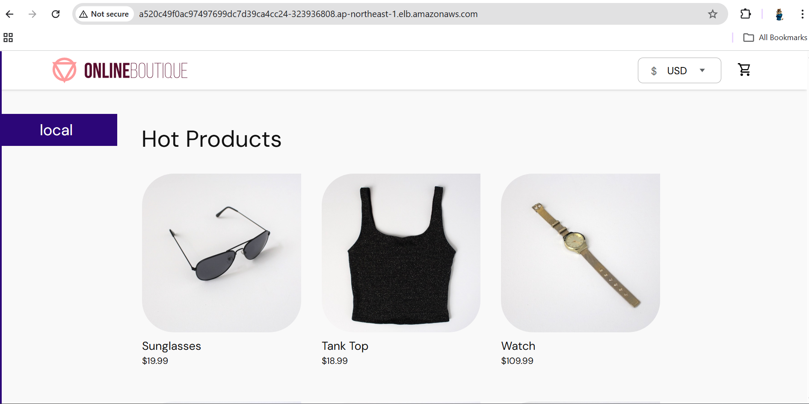

## 🚀 E-Commerce Microservices Deployment on AWS EKS (Manual Setup)

This project demonstrates the deployment of a containerized **E-commerce microservices application** on **AWS EKS**, using **Terraform**, **Docker**, and **Kubernetes**, with a monitoring setup powered by **Prometheus and Grafana**.

---

## 🧩 Architecture Overview

* **Infrastructure as Code:** Terraform provisions EC2 & EKS
* **Containerization:** Docker builds microservices
* **Registry:** AWS ECR stores images
* **Orchestration:** Kubernetes (EKS) manages services
* **Monitoring:** Prometheus + Grafana via `monitor.sh`

---

## ⚙️ Prerequisites

* AWS Account with proper IAM permissions
* Terraform installed
* Docker installed
* kubectl installed
* AWS CLI configured
* Helm installed

---

## 🏗️ Step 1: Provision Infrastructure

```bash
terraform init
terraform apply -auto-approve
```

---

## ☸️ Step 2: Configure kubectl

```bash
aws eks --region ap-northeast-1 update-kubeconfig --name demo-cluster
kubectl get nodes
```

---

## 🐳 Step 3: Build and Push Docker Images

```bash
cd Microservices
./docker_image_buid_push.sh
```

---

## 📦 Step 4: Deploy Microservices to Kubernetes

```bash
kubectl apply -f kubernetes-manifests/
```

```bash
kubectl get pods
kubectl get svc
```

---

## 🌐 Step 5: Access Application

```bash
kubectl get svc frontend-external
```
Output => 

```text
http://<EXTERNAL-IP>
```
---

## 📊 Step 6: Setup Monitoring (Prometheus + Grafana)

```bash
chmod +x monitor.sh
./monitor.sh
```

---

## 🛠️ monitor.sh Script

```bash
#!/bin/bash

helm repo add prometheus-community https://prometheus-community.github.io/helm-charts
helm repo update

kubectl create namespace monitor

helm install prometheus prometheus-community/kube-prometheus-stack \
  --namespace monitor

kubectl patch svc prometheus-grafana -n monitor \
  -p '{"spec": {"type": "LoadBalancer"}}'

kubectl get svc -n monitor prometheus-grafana
```

---

## 🔐 Grafana Access

```bash
kubectl edit svc grafana-prometheus -n monitor
`## Change cluster ip to LoadBalancer``

```bash
kubectl get svc -n monitor prometheus-grafana
```

```bash
kubectl get secret prometheus-grafana -n monitor \
  -o jsonpath="{.data.admin-password}" | base64 --decode ; echo
```

Output =>  

* **Username:** admin
* **Password:** Retrieved from secret


## Jenkins 
   ** Install the required packages in the jenkins instance.
   ** Get the password in the given path after hosting the jenkins dashboard.
   ** Install the Plugins and set your aws credentials in the credentials at manage jenkins.
   ** Create Job (Pipeline Script).
   ** Build it.
   ** Output =>   


